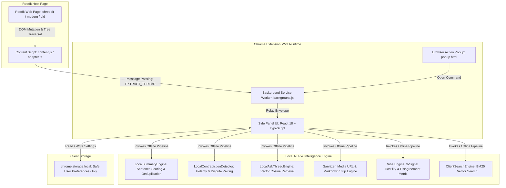
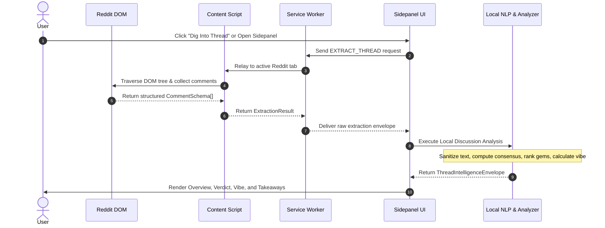

# RedditDIG Architecture & Engineering Specification

> **Version:** 1.0.0  
> **Target Platform:** Google Chrome (Manifest V3 - MV3)  
> **Design Philosophy:** 100% Local-First · Zero Remote Dependencies · Private by Design

---

## 1. Project Overview

### 1.1 Purpose
**RedditDIG** is a production-grade, local-first Chrome Extension (MV3) engineered to extract deep qualitative and statistical intelligence from complex Reddit discussions. It transforms dense, chaotic comment trees into clear, structured insights without relying on remote servers, cloud LLMs, or external APIs.

### 1.2 Key Features
1. **Thread Verdict & Statistical Consensus**: Mathematically computes majority vs. plurality viewpoints, community agreement ratios, and net vote signals.
2. **Deterministic Extractive Summarization**: Generates citation-grounded TL;DR overviews, key takeaways, points of consensus, and polarizing clashes.
3. **Discussion Vibe (Conversational Temperature)**: Quantifies discussion heat and tension (0.0–10.0 scale) based on hostility markers, disagreement density, and argument depth.
4. **Ranked Intelligence Discovery**: Identifies *Best Supported Claims*, *Most Upvoted Thoughts*, *Heavily Disputed Points*, and *Hidden Gems* buried deep in comment branches.
5. **Local Vector & Hybrid Search**: Sub-millisecond keyword and cosine-similarity vector retrieval over all thread comments using bundled n-gram subword embeddings.
6. **"Ask This Thread" Q&A Engine**: Grounded semantic question answering citing specific participants and comments.
7. **Participant Analytics**: Original Poster (OP) interaction tracking, answer resolution detection, and top contributor metrics.
8. **Vertical Intelligence**: Automatic domain detection for consumer advice, tech recommendations, software troubleshooting, and finance debates.

---

## 2. System Architecture

RedditDIG operates strictly within the user's browser sandbox using standard Chrome Extension Manifest V3 primitives.



### 2.1 Component Relationships

1. **Content Script (`adapter.ts`)**:
   - Injected into Reddit tabs (`https://*.reddit.com/*`).
   - Adapts dynamically across modern web components (`<shreddit-comment>`), new Reddit (`data-testid="comment"`), and classic `old.reddit.com` layouts.
   - Extracts complete comment trees, nested depths, scores, timestamps, award signals, and author metadata.
   - Provides smooth automated scrolling and visual highlighting when users click source citation badges.

2. **Background Service Worker (`background/index.ts`)**:
   - Manages side panel lifecycle via `chrome.sidePanel.open()`.
   - Handles extension commands and keyboard shortcuts (`Ctrl+Shift+L` / `Cmd+Shift+L`).
   - Facilitates secure, asynchronous message routing between active Reddit tabs and the side panel UI.

3. **Side Panel Application (`Sidepanel.tsx`)**:
   - React 18 single-page application hosted in the Chrome side panel.
   - Built with an elegant design system featuring high-contrast typography, crisp slate borders, and Royal Blue accents.
   - Organizes intelligence into 5 tabs: **Overview**, **Opinions**, **Insights**, **People**, and **Search**.

4. **Local NLP & Statistical Engines (`services/nlp/`)**:
   - **`sanitizer.ts`**: Strips raw preview URLs, markdown image/GIF tokens (``), HTML tags, and ensures overflow-safe, human-readable text.
   - **`summary.ts`**: Deterministic TF-IDF extractive summarization with citation grounding.
   - **`contradictions.ts`**: Extracts paired opposing claims and direct clashes.
   - **`ask.ts`**: Subword vector cosine matching and question answering.
   - **`analyzer.ts`**: Multi-factor statistical scoring, consensus calculation, and temperature analysis.

---

## 3. Directory Structure

```text
RedditDIG/
├── .github/
│   └── workflows/
│       └── ci.yml                 # Automated CI/CD release gate workflow
├── .gitignore                     # Production Git exclusion rules
├── .env.example                   # Environment template documenting zero-credential policy
├── ARCHITECTURE.md                # System design & engineering specification
├── CHANGELOG.md                   # Semantic version release notes
├── CODE_OF_CONDUCT.md             # Contributor Covenant Code of Conduct
├── CONTRIBUTING.md                # Open-source contribution guidelines
├── LICENSE                        # MIT License
├── PRIVACY.md                     # Comprehensive privacy policy & legal compliance
├── README.md                      # Public project documentation & showcase
└── extension/                     # Chrome Extension Source Tree
    ├── icons/                     # Standard Chrome extension icons (16, 48, 128)
    ├── manifest.json              # Chrome Extension MV3 manifest
    ├── package.json               # Dependencies and build scripts
    ├── popup.html                 # Extension icon quick-launcher HTML
    ├── sidepanel.html             # Primary extension side panel HTML
    ├── tsconfig.json              # Strict TypeScript configuration
    ├── vite.config.ts             # Multi-entry Vite bundler configuration
    ├── scripts/
    │   └── audit-production.mjs   # Zero-trust production security & leak audit script
    └── src/
        ├── background/            # MV3 background service worker
        │   └── index.ts
        ├── components/            # React UI components
        │   ├── common/            # Shared components (Header, Logo, Tabs, CommentCard)
        │   ├── insights/          # Intelligence cards (Summary, Opinions, Health, Rankings)
        │   ├── people/            # Participant & OP interaction analytics
        │   ├── search/            # Ask Thread & hybrid search drawer/bar
        │   └── thread/            # Discussion breakdown & debate map
        ├── content/               # Content scripts & DOM adapters
        │   ├── adapter.ts         # Multi-generation Reddit DOM extractor
        │   └── index.ts
        ├── popup/                 # Browser action popup view
        │   ├── Popup.tsx
        │   └── index.tsx
        ├── services/              # Core business logic and NLP services
        │   ├── analyzer.ts        # Statistical ranking & consensus analyzer
        │   ├── reddit.ts          # URL helpers & highlight navigation
        │   ├── storage.ts         # chrome.storage.local wrapper
        │   ├── nlp/               # Offline NLP pipeline
        │   │   ├── ask.ts         # In-thread semantic question answering
        │   │   ├── contradictions.ts # Contradiction & clash pairing
        │   │   ├── sanitizer.ts   # Prose sanitization & overflow prevention
        │   │   └── summary.ts     # Deterministic extractive summary engine
        │   └── search/            # Client-side search engine
        │       ├── embedding.ts   # Subword n-gram vector embeddings
        │       └── search.ts      # Hybrid TF-IDF / vector search
        ├── sidepanel/             # Primary Sidepanel application
        │   ├── Sidepanel.tsx
        │   └── index.tsx
        ├── types/                 # TypeScript interfaces and schema definitions
        │   └── index.ts
        └── index.css              # Design system stylesheet
```

---

## 4. Data Flow

### 4.1 End-to-End Extraction & Intelligence Flow



### 4.2 Authentication Flow
**No authentication flow exists by design.**  
RedditDIG requires zero user registration, zero OAuth tokens, zero Reddit API credentials, and zero telemetry accounts. The user's existing browser session on Reddit provides access to rendered DOM elements.

### 4.3 Third-Party Integrations
- **Reddit Web Pages (`https://*.reddit.com/*`)**: Read-only DOM traversal of public discussions currently viewed by the user.
- **Zero Remote Services**: No external servers, LLM providers (OpenAI, Groq, Anthropic), cloud databases, or analytics trackers are contacted.

---

## 5. Deployment & Production Standards

### 5.1 Chrome Web Store Distribution
- **Manifest Version:** MV3.
- **Permissions:** `sidePanel`, `tabs`, `activeTab`, `scripting`, `storage`.
- **Content Security Policy (CSP):**
  ```json
  "content_security_policy": {
    "extension_pages": "script-src 'self'; object-src 'self'; connect-src 'self' https://*.reddit.com https://reddit.com;"
  }
  ```
  Strictly blocks `unsafe-eval`, inline scripts, external CDNs, and remote telemetry domains.

### 5.2 Scalability & Performance Benchmarks
- **Large-Thread Processing:** Stress-tested against 1,000+ comment threads with deep reply hierarchies.
- **Analysis Latency:** Under 350ms for complete deterministic synthesis.
- **Memory Footprint:** In-memory footprint under 45MB in Chrome extension sandbox.
- **Zero Network Egress:** Analysis succeeds even with the device disconnected from the internet.

### 5.3 Automated CI/CD Release Gate Pipeline
RedditDIG utilizes GitHub Actions (`.github/workflows/ci.yml`) to enforce an unbroken 100/100 production release gate on every push and pull request:
1. **Clean Installation:** `npm ci` on Node.js 20 LTS runner.
2. **Type Safety:** Strict zero-warning TypeScript compilation (`tsc --noEmit`).
3. **Production Build & Verification:** Vite compilation, manifest verification, and automated ZIP packaging (`redditdig-extension.zip`).
4. **Static Security Audit:** Executing `scripts/audit-production.mjs` to block embedded keys, demo flags, or prohibited endpoints.
5. **Artifact Archival:** Production ZIP package uploaded as a verified workflow artifact.

---

## 6. Engineering Decisions & Tradeoffs

| Architecture Choice | Tradeoff Made | Justification |
| :--- | :--- | :--- |
| **Pure Local-First NLP vs. Remote Cloud LLM** | No arbitrary generative prose; strictly bounded to extractive and template-synthesized statements. | Eliminates recurring API token costs, prevents hallucinations, removes rate limits, and provides absolute user privacy. |
| **Direct DOM Traversal vs. Official Reddit API** | Requires resilient multi-version DOM adapters (`shreddit`, `new`, `old`). | Eliminates requirement for Reddit Developer App API keys, user OAuth credentials, and enterprise API pricing. |
| **Offline Vector N-Gram Embeddings vs. Remote Vector DB** | Dimension-bounded hashing embeddings instead of 1536-dim Transformer models. | Instant zero-latency initialization, no 500MB ONNX model download, runs instantly on any machine. |
| **Vanilla CSS Design System vs. Heavy Tailwind Runtime** | Requires maintaining centralized custom properties in `index.css`. | Zero stylesheet build bloat, instantaneous side panel rendering, full Chrome extension CSP compliance. |

---

## 7. Security Model & Defensive Engineering

1. **Static Pre-Commit Security Auditing (`audit-production.mjs`)**:
   Automatically verifies that zero API keys (`gsk_...`), zero mock data, zero console leaks of secrets, and zero prohibited remote endpoints exist in source code or production bundles.
2. **Comprehensive Input Sanitization (`sanitizer.ts`)**:
   Strips `<script>`, `<style>`, `javascript:` pseudo-protocols, HTML entities, raw URLs, and markdown image/GIF injection strings.
3. **Overflow and Frame Bounds Protection**:
   All cards and containers enforce `min-width: 0`, `overflow: hidden`, `word-break: break-word`, and `overflow-wrap: anywhere` to prevent text layout breaks regardless of comment formatting.
